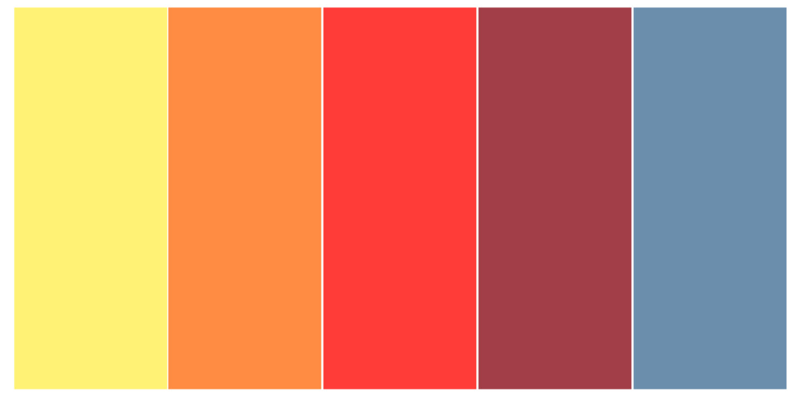

# Pre-School Locator

## Index: 

1. Summary of project
2. UX/UI 
3. Comprehensive Feature List 
4. Structure of Website
5. Technologies Used
6. Testing Steps
7. Future Features Implementation / Bugs
8. Credits

### 1. Summary of project

#### 1a. Context

* Noticing more people of my age becoming parents, and as they look for Infant Care or Pre-Schools near their homes or workplaces, this idea bloomed.

* This website consolidates all the pre-schools available in Singapore as provide by the data.gov.sg. 

#### 1b. User goals

* Audience: Parents with kids looking to enter a Infant Care or Pre-School
* Help parents locate a pre-school near a specified postal code
* Filter pre-schools according to distance and if pre-school is "SPARK Certified"
* Do a comparison between 2 pre-schools

#### 1c. Organisation's goals
* Provide readily updated information on each pre-school to users

#### 1d. Deployed URL
* https://wanyi2882.github.io/pre-school-locator/

### 2. UX/UI 

### 2a.User stories and acceptance criteria
* User Story:
As a parent, I want to find a pre-school that near my home/workplace so that it is easier for me to send/fetch my child.

* Acceptance Criteria: 
Website helps to zoom into a specified location's area and display the available pre-schools in that vicinity

### 2b. Five Planes of UI/UX

#### Strategy: B2C (Business to User)

* User: Parents with kids looking to enter a Infant Care or Pre-School

* User Needs: Find pre-schools in a specified area

* User Pain Points: 
> * Need to go to individual website of each pre-school to know their location or contact them via phone / email to get location and basic information

> * Parent may not know every single pre-school in the vicinity

* Website which consolidates pre-schools in Singapore which allows users search by nearest location

#### Scope
* Will be discussed in 3. Comprehensive features list.

#### Structure
* Will be discussed under 4. Structure of Website.

#### Skeleton
* Refer to Github attachment.

#### Surface 
* Colors: Bright sunny colours to illustrate kids and pre-schools

* Typography: 

* Font size: Generally normal font size as catered for adults (parents)

* Layout: Simple layout to achieve 

* Strategy for achieving mobile responsiveness: Website was built from mobile size and eventually for Ipad and Laptop display

### 3. Comprehensive Feature List 
1. A search bar where the user can enter their postal code to search for pre-schools near the mentioned postal code

2. User can filter to see pre-schools which are 'SPARK Certified' on the map

3. User can also filter to see the pre-schools which are within 100 metres, 500metres and 1 Kilometre distance from the searched postal code on the map

4. A draggable marker which can bring user to another location on the map

5. User can do a comparison between two pre-schools by clicking on the "Add to Compare" button in the popup

### 4. Structure of Website

1. User arrives at home page of the website and keys in the postal code of their desired location (i.e. Home, Workplace, etc) and hits the 'Go' button to search

2. After user hits the 'Go' button, it will bring the user to the page showing user's searched location on the map with a "You are here!" popup.

3. User can then see all the markers on the map that is near the searched location.

4. Map distance filter buttons allows the user to toggle to show or hide markers which are within a certain radius from the searched postal code

5. There is a also a map filter which can toggle to show or hide markers of pre-schools which are 'SPARK Certified'

6. Inside each individual marker popup, there is a 'Add to Compare' button which allows user to add up to 2 pre-schools for comparison.

7. Once the user has added 2 pre-schools, which will be indicated at the bottom of the page

8. The user can also remove the pre-school(s) from the comparison if he/she wants to select another pre-schools by clicking on the 'cross' button

9. Once user has selected 2 pre-schools and is ready to compare them, he/she can then click on the 'Compare' button.

10. Upon clicking on the 'Compare' button, it will bring the user to the comparison page which displays a table showcasing information on the pre-school such as opening hours, availability of services for the different age groups, any special dietary offered as well as the second languages offered.

### 5. Technologies Used

1. HTML
-  A markup language which provides the structure of a website to be displayed on web browsers.

2. CSS (Cascading Style Sheet)
-  A style sheet language used for describing the presentation of a document written in this HTML page.

3. JavaScript
- Programming language which creates dynamic behaviour to a webpage. It will execute actions and create interaction between the website and their users.

4. Bootstrap
- Framework for building responsive, mobile-first sites.

5. Leaflet
- Open-source JavaScript library for mobile-friendly interactive maps. 

6. Geocoding API
- From https://geocode.xyz/api which returns the latitude and longtitude of a given postal code in JSON format

7. Axios
- Promise based HTTP client for the browser

8. Font Awesome
- Library with icon set and toolkit for website 

9. Google Fonts
- Library which includes free and open source font families

10. Csvtojson
- CSV Parser which converts CSV files to JSON format

### 6. Testing Steps

| Test Case # | Test Case Description | Test Steps| Expected Result | 
|-------------|:---------------------:|----------:|----------------:|
|             |Prerequisite: The user is at landing page.           |    
| 01.| Search for pre-school by postal code| 1) User enters postal code as "680213"    2) User enters postal code as "68021" (short of one 1 digit)    3) User enters postal code as "abc123" (Postal code containing numbers)|1) Goes to page displaying map    2) Alert user to key a 6 digit postal code    3) Alert usert to key a 6 digit postal code|
||Prerequisite: User sucessfully keys in postal code and arrives at page displaying map|||  
|02.| Draggable Marker| 1) User clicks and drags "draggable marker"| "draggable marker" will move to new position on the map. Distance markers will also be updated according to the new position|  
| 03.| Adding pre-school for comparison| 1) User clicks on the individual popups which will have the "Add to Compare" button. User selects one popup and clicks the "Add to Compare" button    2) User tries to add more than 2 pre-schools for comparison| 1) The pre-school gets added to comparison preview table at the bottom of the page    2) Alert user that they can only add a maximum of 2 pre-schools |
|04.| Comparing pre-school | 1) User has added 2 pre-schools to the comparison preview table (Which will be displayed at the bottom of the page) and clicks "Start Compare" button    2) User only selected 1 pre-school and hits the the "Start Compare" button| 1) Brings user to the comparison table page comparing between the 2 selected pre-schools    2) Alert User to add in at least 2 pre-schools for comparison |

### 7. Future Features Implementation / Bugs
1. A legend to show the various markers and the draggable marker
2. Allow user to be able to perform a search function on the postal code on the 2nd page
3. More information on each pre-school (A CSV file on the various fees of each pre-school is available however the file is too big for implementation)
4. Geocode API does not respond sometimes or may need a few refreshes before the URL can work

### 8. Credits

1. Landing page background image from https://www.newlife.org.sg/

